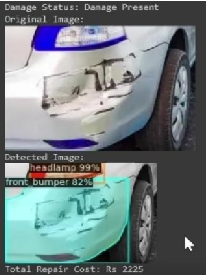

# 🚗 Car Damage Detection and Repair Cost Estimation

## Overview  
This project leverages **Mask R-CNN** and **Deep Learning** techniques to automate car damage detection and repair cost estimation. Designed for applications in the **automotive industry** (e.g., insurance providers, repair shops), this solution streamlines the claims process, minimizes human error, and enhances customer satisfaction.  

### Key Features  
- **Damage Detection**: High-accuracy car damage detection using Mask R-CNN with ~94% precision.  
- **Repair Cost Estimation**: Predicts repair costs based on detected damage and Intersection-over-Union (IoU) metrics.  
- **Automated Claims Processing**: Streamlines insurance claims by integrating image-based analysis and cost estimation.  
- **Transparency and Efficiency**: Employs color splash visualization for clear identification of damaged areas.  

---

## 📂 Project Structure  
- **Dataset Creation**: Manually annotated datasets with damage instances and repair costs.  
- **Model Training**: Detectron2-based Mask R-CNN fine-tuned on car damage images.  
- **Prediction Pipeline**: Automated damage detection and repair cost estimation using IoU and regression models.  
- **Evaluation**: Performance metrics include Average Precision (AP) and model accuracy across damage categories.

---

## 🛠️ Technologies Used  
- **Deep Learning**: Mask R-CNN for object detection and instance segmentation.  
- **Framework**: Detectron2 for model training and evaluation.  
- **Programming**: Python (NumPy, OpenCV, PyTorch).  
- **Tools**: Google Colab, Jupyter Notebooks.  
- **Visualization**: Color splash technique for enhanced damage segmentation.  

---

## 🔧 Setup  

### Prerequisites  
Ensure the following tools are installed on your system:  
- Python 3.8+  
- CUDA (for GPU support)  
- Detectron2  
- OpenCV  
- NumPy  

## 🖼️ Visual Demonstrations  

### Damage Detection and Cost Estimation  
  
  
  

--

## 🧪 Experimental Results  

| Damage Category   | Average Precision (AP) | Cost Estimation Accuracy |
|--------------------|-------------------------|---------------------------|
| Doors             | 92%                    | ±5%                      |
| Bumpers           | 94%                    | ±7%                      |
| Headlights        | 96%                    | ±4%                      |

---

## 🌟 Future Enhancements  
- **Broader Dataset**: Include more diverse damage scenarios and vehicle types.  
- **Severity Detection**: Improve classification to assess the extent of damage.  
- **Enhanced Cost Prediction**: Integrate real-time repair data from industry partners.  

---
